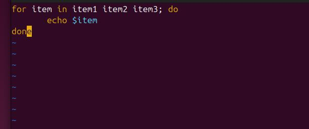

# Control-Flow-in-Shell-Scripting

## Project Review

Control flow in shell scripting determines the execution path of commands based on conditions, loops, and decision-making structures. It includes conditional statements, loops, and case statements to automate tasks efficiently.

For example of a control flow using the conditional statement - if, elif, else;

'#!/bin/bash

read -p "Enter a number: " num

if [ $num -gt 0 ]; then

        echo "The number is postive."
        
elif [$num -lt 0 ]; then

        echo "The number is negative."
        
else

        echo "The number is zero."
fi'

## Task

### Step 1: Create a file and name it "control_flow.sh"

### Step 2: Type the script and run it

'vim control_flow.sh'

'#!/bin/bash

read -p "Enter a number: " num'

### Update the file with the script below

'#!/bin/bash

read -p "Enter a number: " num; echo "You have entered the number $num"'

### Execute the script

'bash control_flow.sh'

## IF Statement

The if statement in shell scripting executes commands based on conditions. It supports logical operators (-eq, -gt, -lt), string comparisons, and file checks to enable decision-making in scripts.
It is started by "if" followed by the conditons which are enclosed in brackets [] and then by "then" which executes the statement is true and closed by if spelled backward.

### For example

'#!/bin/bash

if [ $num -gt 0 ]; then

        echo "The number is postive."'

When the code is executed, it will print "The number is postive" if the condition is true.

'#!/bin/bash

read -p "Enter a number: " num

echo "You have entered the number $num"

if [ $num -gt 0 ]; then

        echo "The number is postive."

fi'

## ELIF Statement

The elif statement in shell scripting provides multiple conditional checks within an if block. It allows execution of different commands based on varying conditions.

'#!/bin/bash

read -p "Enter a number: " num

echo "You have entered the number $num"

if [ $num -gt 0 ]; then

        echo "The number is postive."
        
elif [$num -lt 0 ]; then

        echo "The number is negative."

fi'

## Loops

Loops in shell scripting automate repetitive tasks by executing commands multiple times. The main types are:

- For Loop: Iterates over a list or range.

- While Loop: Runs while a condition is true.

- Until Loop: Runs until a condition becomes true.

###  For Example

Type the script below

'#!/bin/bash

for item in item1 item2 item3; do

        echo $item

done'

Execute it

'#!/bin/bash

for i in 1 2 3 4 5

do

        echo "Hello, World! This is message $i"

done'

The loop starts with for i in 1 2 3 4 5, meaning the i variable will take each value in the list (1, 2, 3, 4, 5) in turns when executed.

For each value of i, the loop execute the command between do and done.

When the script is executed it will print Hello, World! This is message based on the corresponding value of i. 

## Task
### Step 1: Create a shell script and insert it into a file

'#!/bin/bash

for i in {"1..5"}

do

        echo "Counting... $i"

done'

### Step 2: Execute the script.

## C-Style Form

It consists of initialization, condition, and increment/decrement. This loop is useful for numeric iterations and provides better control over loop execution. 

### For example

Insert the script below into a file

'#!/bin/bash

for i in (( i=0; i<5; i++ )); do

        echo "Number $i"

done'

"i=0", is the initialization.
"i<5", is the condition.
"i++", is the increment expression.
"do ... done", encloses the command to be executed.

Execute the script

