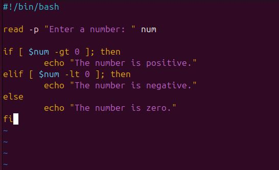

# Control-Flow-in-Shell-Scripting

## Project Review

Control flow in shell scripting determines the execution path of commands based on conditions, loops, and decision-making structures. It includes conditional statements, loops, and case statements to automate tasks efficiently.

For example of a control flow using the if-conditional statement;

	
