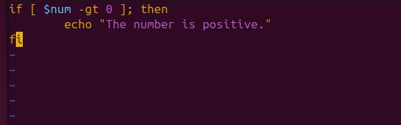

# Control-Flow-in-Shell-Scripting

## Project Review

Control flow in shell scripting determines the execution path of commands based on conditions, loops, and decision-making structures. It includes conditional statements, loops, and case statements to automate tasks efficiently.

For example of a control flow using the conditional statement - if, elif, else;

## Task
### Step 1: Create a file and name it "control_flow.sh"

### Step 2: Type the script and run it

'vim control_flow.sh'

### Update the file with the script below

### Execute the script

## IF Statement

The if statement in shell scripting executes commands based on conditions. It supports logical operators (-eq, -gt, -lt), string comparisons, and file checks to enable decision-making in scripts.
It is started by "if" followed by the conditons which are enclosed in brackets [] and then by "then" which executes the statement is true and closed by if spelled backward.

### For example

When the code is executed, it will print "This is postive" if the condition is true.

