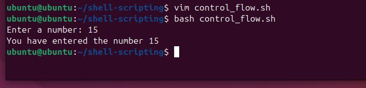

# Control-Flow-in-Shell-Scripting

## Project Review

Control flow in shell scripting determines the execution path of commands based on conditions, loops, and decision-making structures. It includes conditional statements, loops, and case statements to automate tasks efficiently.

For example of a control flow using the conditional statement - if, elif, else;

## Task
### Step 1: Create a file and name it "control_flow.sh"

### Step 2: Type the script and run it

'vim control_flow.sh'

### Update the file with the script below

### Execute the script

## IF Statement

The if statement in shell scripting executes commands based on conditions. It supports logical operators (-eq, -gt, -lt), string comparisons, and file checks to enable decision-making in scripts.
It is started by "if" followed by the conditons which are enclosed in brackets [] and then by "then" which executes the statement is true and closed by if spelled backward.

### For example

When the code is executed, it will print "The number is postive" if the condition is true.

## ELIF Statement

The elif statement in shell scripting provides multiple conditional checks within an if block. It allows execution of different commands based on varying conditions.

## Loops

Loops in shell scripting automate repetitive tasks by executing commands multiple times. The main types are:

- For Loop: Iterates over a list or range.

- While Loop: Runs while a condition is true.

- Until Loop: Runs until a condition becomes true.

###  For Example

Type the script below

Execute it

The loop starts with for i in 1 2 3 4 5, meaning the i variable will take each value in the list (1, 2, 3, 4, 5) in turns when executed.

For each value of i, the loop execute the command between do and done.

When the script is executed it will print Hello, World! This is message based on the current value of i. 

